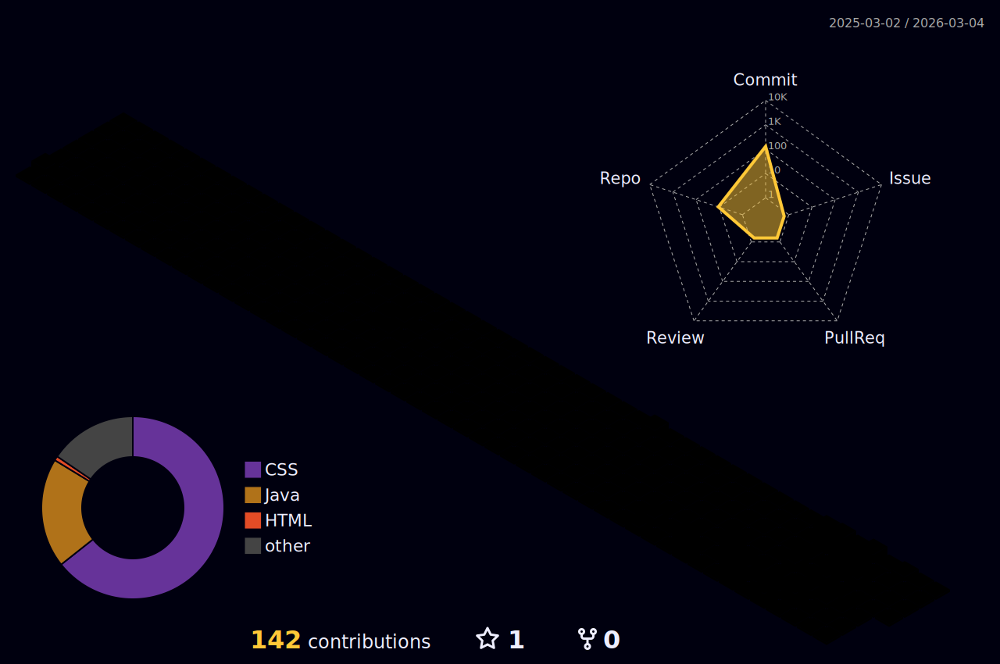

  

  
  

  
  

## 👋 About me

> **MCA Student & Full-Stack Developer** based in Greater Noida. I build intelligent web experiences where clean code meets Generative AI. 

- 🔭 **I’m currently working on:** [AI-Powered Mock Interviewer](https://github.com/PiyushKumar9341) using Gemini API to automate technical rounds.
- 👯 **I’m looking to collaborate on:** Open-source GenAI projects or modern React/Node.js web apps.
- 🤝 **I’m looking for help with:** Mastering advanced system design and low-level system optimization.
- 🌱 **I’m currently learning:** **Data Structures & Algorithms (DSA)** and Multi-Agent AI workflows.
- 💬 **Ask me about:** Java, Full-Stack development, or my latest GenAI certifications.
- ⚡ **Fun fact:** I spend more time naming my variables than actually writing the logic!

---

## 🛠️ Tech Stack & Tooling

### 🤖 Generative AI & Machine Learning

  
  
  
  

### 💻 Full-Stack Development

  

### 🗄️ Databases & Infrastructure

  

---

## 📂 Featured AI Projects

### 🤖 [AI-Powered Mock Interviewer](https://github.com/PiyushKumar9341)
*Intelligent voice-to-voice interview bot that analyzes your resume and gives real-time feedback.*
- **Tech:** React, Gemini API, SpeechRecognition, FastAPI.

### 🧠 [AI Tech Chatbox](https://github.com/PiyushKumar9341)
*A specialized assistant trained to answer questions about my projects and technical expertise.*

---

## 🏙️ GitHub Activity in 3D

  

---

## 📊 Performance Metrics

  
  

  

---

  

  <i>"Code is like humor. When you have to explain it, it’s bad."</i>

